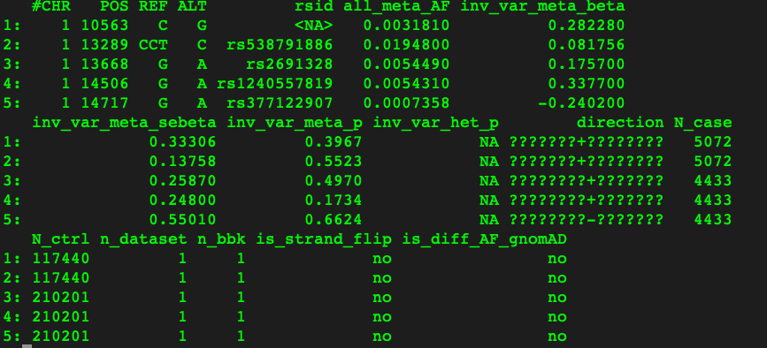

# Pipeline for running PRScs-auto

 

## 1. Prerequisites

### 1.1 Software
- R >= 3.6
- R packages
  - install.packages("data.table")
  - install.packages("pROC")
  - install.packages("boot")
  - install.packages("optparse")
- Python 2 or Python 3 
- Python packages
  - [scipy](https://www.scipy.org/) 
  - [h5py](https://www.h5py.org/) 
- [Plink 1.*](https://www.cog-genomics.org/plink2) or [Plink 2.0](https://www.cog-genomics.org/plink/2.0/) software
- [PRScs](https://github.com/getian107/PRScs) software

### 1.2 Download data resources
- [LD reference panel](https://github.com/getian107/PRScs) for running PRScs
  - Download [1KG-EUR](https://www.dropbox.com/s/mt6var0z96vb6fv/ldblk_1kg_eur.tar.gz?dl=0), e.g., run `wget https://www.dropbox.com/s/mt6var0z96vb6fv/ldblk_1kg_eur.tar.gz?dl=0` in your specific directory, then `tar -zxvf ldblk_1kg_eur.tar.gz`
  - Download [UKBB-EUR](https://www.dropbox.com/s/t9opx2ty6ucrpib/ldblk_ukbb_eur.tar.gz?dl=0), e.g., run `wget https://www.dropbox.com/s/t9opx2ty6ucrpib/ldblk_ukbb_eur.tar.gz?dl=0` in your specific directory, then `tar -zxvf ldblk_ukbb_eur.tar.gz`.
- Leave-YOUR-BIOBANK-out GBMI GWAS summary statistics
  - For 14 endpoints, including `AAA AcApp Asthma Appendectomy COPD Gout HCM HF IPF POAG Stroke Utc ThC VTE`
- [Public GWAS summary statistics](https://docs.google.com/document/d/1gniQxQQs90h1pIGiIcbI-KdMP0kQ0NlF/edit) 
  - **Only include those not overlap with your specific Biobank**. 
- Download the analysis scripts in the [git repository](https://github.com/globalbiobankmeta/PRS)
  - For example: run `git clone https://github.com/globalbiobankmeta/PRS.git` in your specific directory
  
### 1.3 QC steps
- QC for test/target cohort in each ancestry in your specific Biobank.
  - Genotype QC: e.g., MAF > 1%, imputation INFO score > 0.3 (or biobank-specific, e.g., 0.7), genotype missing rates < 5%, p-value of Hardy-Weinberg equilibrium > 1e-6
  - Individual QC: Remove individuals with missing rates > 10%, only **unrelated individuals with SNP-derived genetic relatedness < 0.05** are used in the following prediction analyses.
- QC for GBMI GWAS sumstats will be implemented in the following Step 2. Details are shown [here](https://docs.google.com/document/d/1CU8l6HavYPA8zHeqpbCco7eqMeDNFfoCDZb83QX-rkw/edit).

 

## 2. Format your GWAS sumstats

In the script `toPRScsFormat.sh`, we will filter out variants in GBMI GWAS sumstats as described [here](https://docs.google.com/document/d/1CU8l6HavYPA8zHeqpbCco7eqMeDNFfoCDZb83QX-rkw/edit). Then, we will reformat your GWAS sumstats with the format as: `SNP A1 A2 BETA P` to prepare for running PRScs, as shown:

 

 After filling the variables in  `toPRScsFormat.sh`, specifically:
 
 -  `sumstats`: Full path and file name to your downloaded GWAS sumstats.
 -  `headers`: The column names of GWAS sumstats for "SNP,A1,A2,BETA,P" in the exactly same order, separated by comma. e.g., "rsid,REF,ALT,inv_var_meta_beta,inv_var_meta_p" as shown:
 

 

Then you can run  `bash toPRScsFormat.sh`. You will get the output with "_toPRScs.txt" in the same folder of your GWAS sumstats. The whole process takes around 10 minutes, 25GB to finish with 1 thread/CPU for most phenotypes.

 

**Note** that if you run this script for public GWAS sumstats, please edit the QC part in `toPRScsFormat.R` correspondingly.

 

## 3. Run PRScs-auto

You have to fill the variables in  `run_prscs_auto.sh` which are described in [PRScs github page](https://github.com/getian107/PRScs). Specifically:

- `PATH_TO_REFERENCE`: Full path (including folder name) to the directory that contains information on the LD reference panel (the snpinfo file and hdf5 files). e.g., `YOUR_PATH/ldblk_1kg_eur or YOUR_PATH/ldblk_ukbb_eur`. **Note that we run PRScs using both 1KG-EUR and UKBB-EUR as LD reference panels**.
- `VALIDATION_BIM_PREFIX`: Full path and the prefix of the *.bim file after running QC on the target cohort for each ancestry in your specific Biobank.
- `SUM_STATS_FILE`: Full path and the file name to the GWAS sumstats generated by Step 2 with suffix including "_toPRScs.txt".
- `GWAS_SAMPLE_SIZE`: **Please use the corresponding effective sample sizes generated by Wei Zhou [here](https://drive.google.com/file/u/1/d/1PM7qedvb3cCuhn50LDa2hrbQs1TuC9wD/view?usp=sharing).**
- `OUTPUT_DIR`: Directory and prefix of the output files which will be generated by PRScs.
- `N_THREADS`: number of CPUs/threads used in your job.
- `PATH_TO_PRSCS_DIR`: Full path to where you installed PRScs. You can remove this variable if you `export PATH="YOUR_PATH_InstallPRScs:$PATH"` in your .bashrc file.
- `chrom`: running PRScs by chromosome in parallel or array/batch job is recommended. You have to modify `chrom=${TASK_ID}` accordingly to your cluster setting, e.g., chrom=${ARRAY_ID}. If you cannot run batch jobs, you can use for loop to submit one job for one chromosome each time. 

> Note you should modify `python3` to the python version you are using if needed.

 

Then you can run PRScs-auto using  `bash run_prscs_auto.sh`. You are expected to get the output file (similar to *_pst_eff_a1_b0.5_phiauto_chr22.txt) for each chromosome shown as below:

For your reference: the whole process takes ~1hour, 10GB to finish by chromosome when using 4CPUs for leave-UKBB-out Asthma GBMI GWAS.

 

## 4. Calculate PRS using plink

> **Note that you should first QC for variants with imputation INFO score > 0.3 (or biobank-specific thresholds) and other filters such as \--maf 0.01 \--geno 0.05 \--hwe 1e-6 and QC for individuls: \--mind 0.1 in your target dataset. Only unrelated individuals with genetic relatedness < 0.05 are used.**

Please fill in the variables in `run_prs.sh` using plink 1.* or `run_prs_plink2.sh` using plink 2.0. Specifically:

 -  `bfile`: Full path and prefix to plink files in .bed .bim .fam format
 -  `scorefile`: Full path and file name to the file generated by PRScs in **`Step 3`**.
 -  `outdir`: Full path and prefix to your output **.profile or .sscore** files generated by plink.
 
 

 
Plink/Plink2 is activated to run `--score` using  `bash run_prs.sh` or `bash run_prs_plink2.sh` and generates outputs of suffix with ".profile" or ".sscore"

 

## 5. Merge score files for each chromosome

> **Note:** If you generated *.profile* or *.sscore* files by each chromosome, which is recommended when you have a large target cohort, then you have to merge them first before calculating the accuracy of PRS. You can skip this step if you did not split chromosomes to generate PRS.

You can merge the *.profile* or *.sscore* score files by running `merge_scoreFiles.sh` after filling the variables, specifically:

 -  `wkdir`: Full path to the directory with `*.profile*` or `*.sscore*` score files generated by plink
 -  `file_pattern`: a **regex pattern** in order to list score files for 22 chromosomes
 -  `out_file`: Full path and file name to your output with **`suffix .profile/.sscore`** files for combined PRS

Then you can run  `bash merge_scoreFiles.sh`.

 

## 6. Calculate the PRS accuracy metrics

Details have been given [here](https://github.com/globalbiobankmeta/PRS/blob/main/run_create_prs_metrics.md).

 

>If you have any issues, please feel free to contact Ying Wang (yiwang@broadinstitute.org).

 

 

